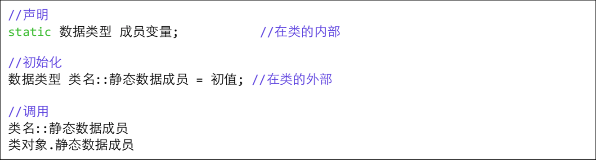

# c++中的静态成员变量和静态成员函数

在 C++中,静态成员是属于整个类的而不是某个对象,静态成员变量只存储 一份供 所有对象共用。所以在所有对象中都可以共享它。使用静态成员变量实 现多个对象之间 的数据共享不会破坏隐藏的原则,保证了安全性还可以节省内存。



## 1.static成员变量的特点

* 1.static 成员变量实现了同类对象间信息共享。
* 2.static 成员类外存储,求类大小,并不包含在内。
* 3.static 成员是命名空间属于类的全局变量,存储在data区。
* 4.static 成员只能类外初始化。
* 5.可以通过类名访问\(无对象生成时亦可\),也可以通过对象访问。

```text
//生成一个Box类，height是一致的
#include <iostream>
using namespace std;
class Box
{
public:
    Box(int l, int w):length(l),width(w) {
    }
    int volume()
    {
        return length * width * height;
    }
    static int height;
    int length;
    int width;
};
int Box::height = 5;
int main() {
    // cout<<sizeof(Box)<<endl;
    // Box b(2,3);
    // cout<<sizeof(b)<<endl;
    cout<<Box::height<<endl;
    Box b(1,1);
    cout<<b.height<<endl;
    cout<<b.volume()<<endl;
    return 0;
}
```

## 2.当static变量定义在Private的时候，就不能在类的外部使用了，这时候就需要使用静态函数了。

```text
//声明
static 函数声明
//调⽤
类名::函数调⽤用 类对象.函数调⽤用
```

```text
#include <iostream>
using namespace std;
class Student
{
public:
    Student(int n,int a,float s):num(n),age(a),score(s){}
    void total()
    {
        count++;
        sum += score;
    }
static float average();
private:
    int num;
    int age;
    float score;
    static float sum;
    static int count;
};
float Student::sum = 0;
int Student::count = 0;

float Student::average() {
    return sum/count;
}

int main() {
    Student stu[3]= {
        Student(1001,14,70),
        Student(1002,15,34),
        Student(1003,16,90)
      };
    for(int i=0; i<3; i++) {
        stu[i].total();
      }
      cout<<Student::average()<<endl;
      return 0;     
}
```

* 1.静态成员函数的意义,不在于信息共享,数据沟通,而在于管理静态数据成员, 完 成对静态数据成员的封装。
* 2.静态成员函数只能访问静态数据成员。原因:非静态成员函数,在调用时this 指 针被当作参数传进。而静态成员函数属于类,而不属于对象,没有 this 指针。
