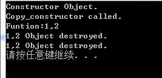

# c++拷贝构造函数的应用场景

c++编译器会默认的提供一个拷贝构造函数，当你显示的写了自己的拷贝构造函数时，就不会调用系统默认的，会调用自己的。

## 1.场景一和场景二

```text
#include "iostream"
using namespace std;
class AA
{
public:
    AA()
    {
        cout <<"我是构造函数  自动被调用" <<endl;
    }
    AA(int _a)
    {
        a = _a;
    }
    AA(const AA &obj2)
    {
        cout<<"我也是构造函数，我是通过另外一个对象obj2来进行初始化"<<endl;
        a = obj2.a + 10;
    }
    ~AA()
    {
        cout <<"我是析构函数" <<endl;
    }
    void getA()
    {
        printf("a:%d\n",a);
    }
protected:
private:
    int a;
};
void ObjPlay()
{
    AA a1(10);

    //赋值构造函数的第一个应用场景，用对象a1来初始化对象a2;
    //AA a2 = a1;//定义初始化

    /*
    AA a2;
    a2 = a1;
    这种方式就和上面的不一样，你可以这样理解：因为AA a2;这句话已经进行了初始化，而拷贝构造函数本质上也是初始化。
    用a2=a1，这是c++编译器提供的浅拷贝，是一个赋值操作，如果重载了操作符，就会调用重载操作符的函数。
    */

    //赋值构造函数的第二种应用场景
    AA a2(a1);//用a1来初始化a2。
    a2.getA(); //输出20
}
void main()
{
    ObjPlay();
    system("pause");
}
```

## 2.场景三

```
#include "iostream"
using namespace std;
class Location
{
public :
    Location(int xx=0, int yy = 0)
    {
        X = xx ;  Y = yy ;  cout << "Constructor Object.\n" ;
    }
    //复制构造函数
    Location( const Location & p )
    {
        X = p.X ;  Y = p.Y ;   cout << "Copy_constructor called." << endl ;
    }
    ~Location()
    {
        cout << X << "," << Y << " Object destroyed." << endl ;
    }
    int  GetX () { return X ; }        int GetY () { return Y ; }
private:
   int  X , Y ;
};
void f( Location p )
{
   cout << "Funtion:" << p.GetX() << "," << p.GetY() << endl ;  
}
void mainobjplay()
{  
    Location A ( 1, 2 ) ; //调用Location 的构造函数
    //1.f(A)满足用一个对象初始化另一个对象的条件，所以先会调用拷贝构造函数，调用完之后进去到f()函数
    //2.然后调用p的析构函数，再调用A的析构函数
    f ( A ) ;
}
void main()
{  
    mainobjplay();
    system("pause");
}
```



## 场景四（有关匿名对象的去和留）

```
#include <iostream>
using namespace std;
class Location
{
public:
//带参数的构造函数
Location( int xx = 0 , int yy = 0 ) {
            X = xx ;
            Y = yy ;
            cout << "Constructor Object." <<endl;
 }
 //copy构造函数 完成对象的初始化
 Location(const Location & obj) {//copy构造函数
           X = obj.X;
           Y = obj.Y;
           cout <<"Copy Constructor." <<endl;
}
~Location()
        {
            cout << X << "," << Y << " Object destroyed." << endl ;
        }
int  GetX () {
    return X;
}
int GetY () {
    return Y;
}
private :
  int X;
  int Y;
};
//g函数 返回一个元素
//结论1 : 函数的返回值是⼀个元素 (复杂类型的), 返回的是⼀个新的匿名对象(所以会调⽤用匿名对象类的copy构造函数)
//结论2: 有关匿名对象的去和留
//如果⽤匿名对象初始化另外⼀个同类型的对象, 匿名对象转成有名对象
//如果用匿名对象赋值给另外⼀个同类型的对象, 匿名对象被析构
//
//设计编译器的⼤大⽜牛们: //我就给你返回⼀一个新对象(没有名字 匿名对象)

Location g()
{
    Location temp(1, 2);
    return temp;
}

void test1()
{
  g();
}

void test2()
{
  //⽤匿名对象初始化m 此时c++编译器 直接把匿名对转成m; (扶正) 从匿名转成有名字了m //就是将这个匿名对象起了名字m,他们都是同⼀个对象
  Location m = g();
  printf("匿名对象,被扶正,不会析构掉\n");
  cout<<m.GetX()<<endl;;
}

void test3()
{
    //⽤匿名对象 赋值给 m2后, 匿名对象被析构
    Location m2(1, 2);
    m2 = g();  //=浅拷贝，不会调用拷贝构造函数
    printf("因为用匿名对象=给m2, 匿名对象被析构\n");
    cout<<m2.GetX()<<endl;;
}

int main(void)
{
    test1();
    test2();
    test3();
    return 0;
}
```
