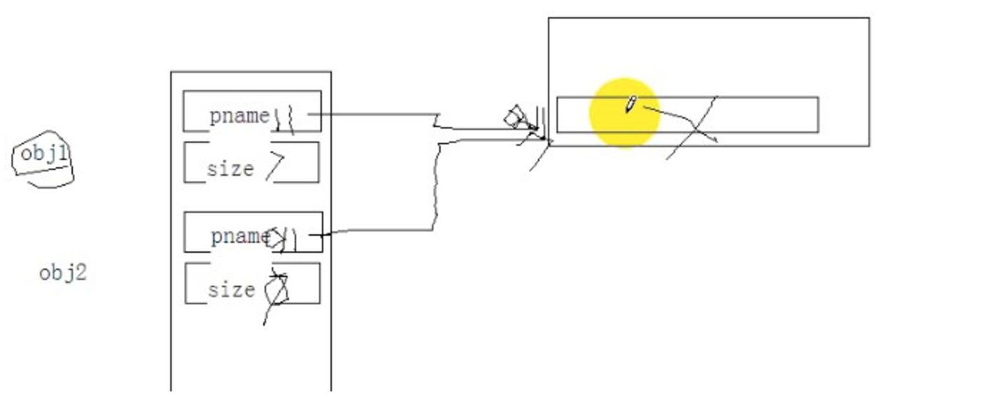

# c++深拷贝和浅拷贝

## 1.浅拷贝

```
#include "iostream"
using namespace std;
class Name
{
public:
    Name(const char *pname)
    {
        size = strlen(pName);
        pName = (char *)malloc(size+1);
        strcpy(pName, pname);
    }
    ~Name()
    {
        cout<<"开始析构"<<endl;
        if (pName != NULL)
        {
            free(pName);
            pName = NULL;
            size = 0;
        }
    }
private:
    char *pName;
    int size;
};
void playObj()
{
    Name obj1("obj1...");
    Name obj2 = obj1; //等号操作，是一个浅拷贝,会调用默认的拷贝构造函数，浅拷贝
    cout<<"业务操作"<<endl;
}
void main()
{
   playObj();
}
```

谁先初始化，谁后析构。当第二次析构的时候，程序挂掉了。以下为对应的内存模型. 

## 2.解决方案，深拷贝

```text
#include "iostream"
using namespace std;
class Name
{
public:
    Name(const char *pname)
    {
        size = strlen(pname);
        pName = (char *)malloc(size + 1);
        strcpy(pName, pname);
    }
    Name(Name &obj)
    {
        //用obj来初始化自己
        pName = (char *)malloc(obj.size + 1);
        strcpy(pName, obj.pName);
        size = obj.size;
    }
    ~Name()
    {
        cout<<"开始析构"<<endl;
        if (pName!=NULL)
        {
            free(pName);
            pName = NULL;
            size = 0;
        }
    }
protected:
private:
    char *pName;
    int size;
};
void playObj()
{
    Name obj1("obj1.....");
    Name obj2 = obj1; //对象2的创建并初始化，不会调用构造函数，直接调用拷贝构造函数
    cout<<"业务操作。。。5000"<<endl;
}
void main()
{
    playObj();
    system("pause");
}
```
