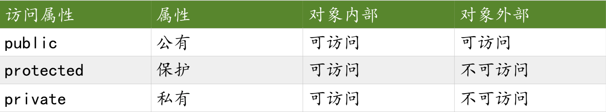

# c++类基础

## 1.从struct说起

当单一变量无法完成描述需求的时候,结构体类型解决了这一问题。可以 将多个类型打包成一体,形成新的类型。这是 c 语言中封装的概念。

```text
#include <iostream>
using namespace std;
struct Date {
    int year;
    int month;
    int day;
};
void init(Date &d)
{
    cout<<"year,month,day:"<<endl;
    cin>>d.year>>d.month>>d.day;
}
void print(Date & d)
{
    cout<<"year month day"<<endl;
    cout<<d.year<<":"<<d.month<<":"<<d.day<<endl;
}
bool isLeapYear(Date & d)
{
    if((d.year%4==0&& d.year%100 != 0) || d.year%400 == 0)
        return true;
    else
        return false;
}
int main() {
    Date d;
    init(d);
    print(d);
    if(isLeapYear(d))
        cout<<"leap year"<<endl;
    else
        cout<<"not leap year"<<endl;
    return 0;
}
```

对C语言中结构体的操作，都是通过外部函数来实现的。比如

```
void init(Date &d);
void print(Date & d);
bool isLeapYear(Date & d);
```

## 2.class的封装性

**struct 中所有行为和属性都是 public 的\(默认\)。C++中的 class 可以指定行 为和属性的访问方式。**  比如我们用 struct 封装的类,即知其接口,又可以直接访问其内部数据,这样 却没有达到信息隐蔽的功效。而 class 则提供了这样的功能,屏蔽内部数据,对外 开放接口。

```
#include <iostream>
using namespace std;
class Date
{
public:
    void init(Date &d);
    void print(Date & d);
    bool isLeapYear(Date & d);
private:
    int year;
int month;
int day;
};
void Date::init(Date &d)
{
    cout<<"year,month,day:"<<endl;
    cin>>d.year>>d.month>>d.day;
}
void Date::print(Date & d)
{
    cout<<"year month day"<<endl;
    cout<<d.year<<":"<<d.month<<":"<<d.day<<endl;
}
bool Date::isLeapYear(Date & d)
{
    if((d.year%4==0 && d.year%100 != 0) || d.year%400 == 0)
        return true;
    else
        return false;
}
int main() {
    Date d;
    d.init(d);
    d.print(d);
    if(d.isLeapYear(d))
        cout<<"leap year"<<endl;
    else
        cout<<"not leap year"<<endl;
    return 0;
}
```
