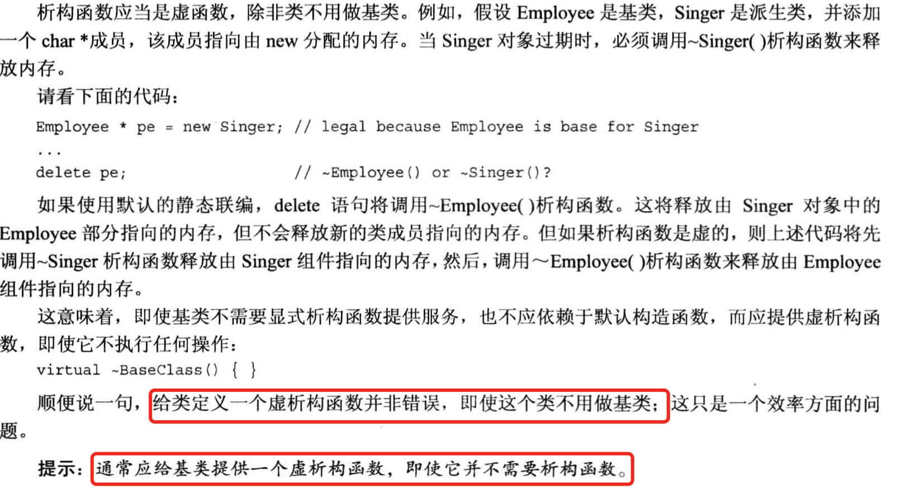

# 虚函数注意事项

* 1. 在基类中使用关键字vritual的方法，在后面所有的派生类中都是虚的。

* 2. 使用引用或者指针来调用虚方法，程序将使用指向对象的方法的行为。

* 3. 如果定义的类为基类，并且要在派生类中重新定义方法的行为，应该声明为virtual的。

此外还有一些其他的注意点：

* 1.构造函数不能是virtual的。首先派生类不会继承父类的构造函数，创建对象时，将调用子类的构造函数，然后派生类的构造函数将使用基类的一个构造函数。所以将构造函数声明为虚函数没有什么意义。

* 2. 析构函数，析构函数应该是虚函数。


* 3.友元
友元函数不能是虚函数，因为友元不是类成员，而只有成员才能是虚函数。

* 4. 没有重新定义
重新定义将隐藏方法。
例如下面的代码：
```cpp
class Dwel1ing
{
public:
    virtual void show(int a) const;
};

class Hovel : public Dwelling
{
public:
    virtual void show() const;
}
```
这会出问题，可能出现以下的编译警告,也可能不出现警告，但是不管咋样，代码将具有如下的含义：
```
Hovel trump;
trump.show(); //可用
trump.show(1); //不可用
```
重新定义，不会生成函数的两个重载版本，而是隐藏了第一个接收int参数的父类版本。总之，重新定义继承的方法并不是重载。

这引出了两条经验：
* 1. 如果重新定义继承的方法，应该确保与父类的原型保持完全相同
* 2. 如果返回类型是**父类引用或者指针**，则可以修改为指向子类的引用或指针。这种特性被称为返回类型协变（covariance of return type）

```cpp
class fu
{
public:
    vritual fu &build(int n)
};
class zi : public func
{
    virtual zi & build(int n);
};
```
这种方式是OK的，但是只适用于返回值，不适用于参数。
