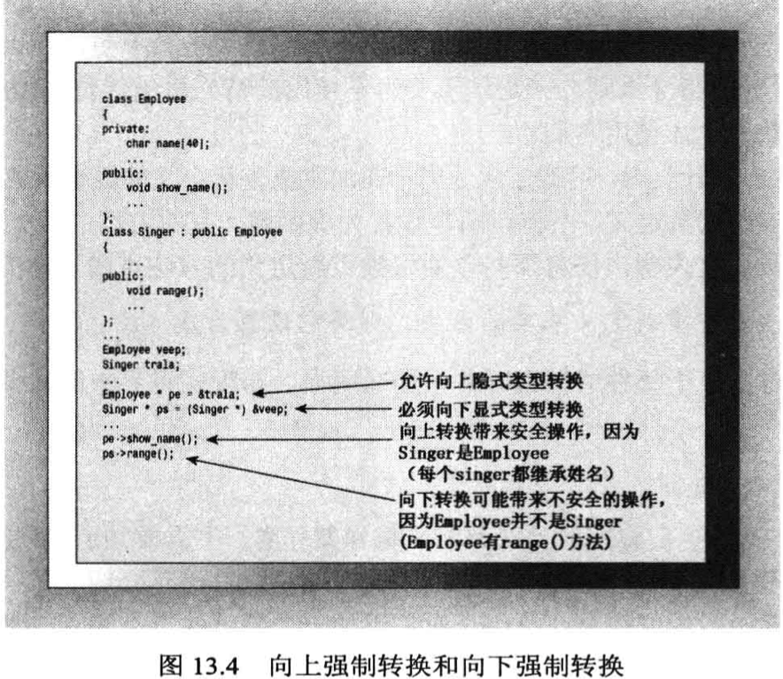
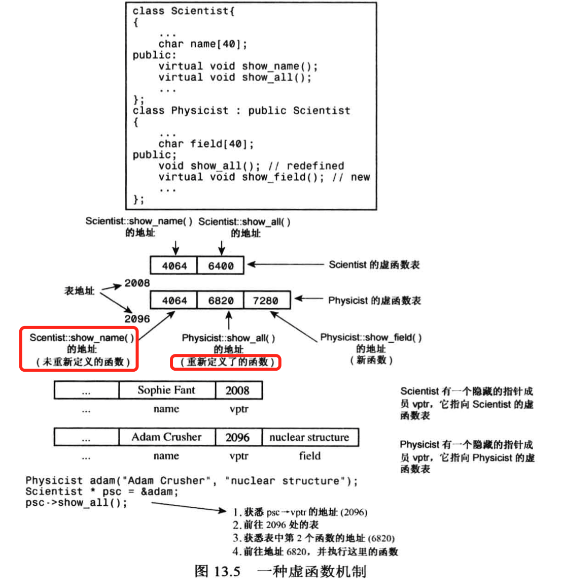

程序调用函数时，编译器决定哪个是可执行的代码块。
在C语言中，这非常简单，因为每个函数名称都对应一个不同的函数，在c++中，由于函数重载的缘故，这项任务更加的复杂。编译器必须查看函数参数以及函数名才能决定使用哪个函数。

然而，c++编译器可以在编译的过程中完成中联编，在编译过程中进行联编就被称为静态联编。

又然而，虚函数使这项工作变得更加困难，因为要使用哪一个函数是不能在编译时决定的，因为编译器不知道用户将选择哪种类型的对象。只有在运行时才能去判断选择正确的方法，被称为动态联编。

### 1.指针和引用类型的兼容性
为什么要先介绍这个？因为在c++中，动态联编是与通过**指针和引用**调用方法相关的，
或者从某种程度上说，这是由公有继承决定的。c++编译器在建立is-a关系的时候，规定了一种如何处理指向对象的指针和引用的规则。

通常情况下，c++编译器不允许把一种类型的地址赋值给另一种类型的指针，也不允许一种类型的引用指向另一种类型,比如下面都是错误的：
```
double x = 1.5;
int *pi = &x;
int &r1 = x;
```
但是，指向父类的引用或指针可以引用子类的对象，而**不必进行显示类型转换**。如下，是OK的：
```
BrassChild dilly("tom", 33,200);
Brass *pb = &dilly;
Brass &rb = dilly;
```
将子类引用或指针转换为父类引用或指针称为**向上强制转换**，该规则不需要进行显示类型转换。该规则是is-a关系的一部分。BrassPlus的对象都是Brass对象，因为它继承了Brass对象所有的数据成员和成员函数。所以，可以对Brass对象执行任何操作，都适用于BrassPlus对象，因此，为处理Brass引用而设计的函数都可以对BrassPlus对象执行同样的操作，而不必担心会导致任何问题。**将指向对象的指针作为函数参数时，也是如此。** 并且向上强制转换是可以传递的，比如BrassPlus派生出了BrassPlusPlus对象，则Brass指针或者引用可以引用Brass对象，BrassPlus对象或BrassPlusPlus对象。

相反的过程：将父类指针或者引用转换为子类指针或者引用，称为**向下强制转换。**如果不使用显示类型转换，则向下强制转换是不允许的。原因是is-a的关系是不可逆的。



对使用基类引用或者指针作为参数的函数调用，将进行向上转换，比如下面代码，假设ViewAcct()是虚函数：
```
void fr(Brass &rb); //use rb.ViewAcct()
void fp(Brass *pb); //use pb->ViewAcct()
void fv(Brass b);   //use b.ViewAcct()

int main()
{
    Brass b("test", 443, 444);
    BrassPlus bp("fff", 1234, 4455);

    fr(b);  //父类的ViewAcct()
    fr(bp); //子类的ViewAcct()
    fp(b);  //父类的ViewAcct()
    fp(bp); //子类的ViewAcct()
    fv(b);  //父类的ViewAcct()
    fv(bp); //父类的ViewAcct()
}
```
**因为fv是按照值传递的，只能将BrassPlus对象的Brass部分传递给函数fv()**,对于fr和fp函数，随着引用和指针发生的隐式向上转换，将分别调用父类和子类的ViewAcct()函数。


### 2. 虚成员函数和动态联编
c++编译器对虚方法使用动态联编。

通常，编译器处理虚函数的方法是：给每个对象添加一个隐藏的成员。该成员保存了一个指向函数地址数组的指针。这种数组称为虚函数表（vtbl）。虚函数表中存储了为类对象进行声明的虚函数的地址。例如，基类包含一个vptr，指向基类中所有的虚函数的地址表。派生类对象也包含一个vptr，**如果派生类提供了虚函数的新定义，该虚函数表将保存新函数的地址；如果派生类没有重新定义虚函数，则保存函数原始版本的地址。如果派生了定义了新的虚函数，则新的函数地址也被添加到vptr指向的数组中**



调用虚函数时，程序将查看存储在对象中的vptr地址，寻找对应的函数地址。但是虚函数会带来额外的成本问题：
比如对象增大。额外的查找消耗。
