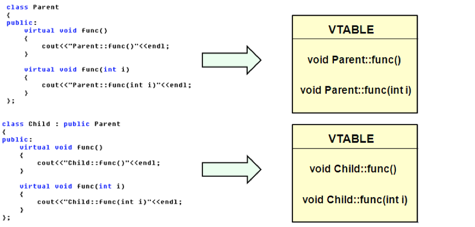
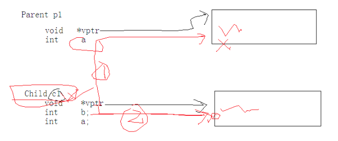

# c++中多态的实现原理

### 1.多态的实现效果
同样的调用语句有多种不同的表现形态；

#### 1.1.多态实现的三个条件
有继承、有virtual重写、有父类指针（引用）指向子类对象。

### 1.2.多态的C++实现
virtual关键字，告诉编译器这个函数要支持多态；不要根据指针类型判断如何调用；而是要根据指针所指向的实际对象类型来判断如何调用

### 1.3.实现多态的理论基础
函数指针做函数参数。

### 2.C++中多态的实现原理
当类中声明虚函数时，编译器会在类中生成一个虚函数表
虚函数表是一个存储类成员函数指针的数据结构
虚函数表是由编译器自动生成与维护的
virtual成员函数会被编译器放入虚函数表中
存在虚函数时，每个对象中都有一个指向虚函数表的指针(vptr指针)



```
通过虚函数表指针VPTR调用重写函数是在程序运行时进行的，因此需要通过寻址操作才能确
定真正应该调用的函数。而普通成员函数是在编译时就确定了调用的函数。在效率上，虚函数的效率要低很多。
```

### 3.证明vptr指针的存在
```
#include "iostream"
using namespace std;

class AA
{
public:
    virtual void print()
    {
        printf("dddd\n");
    }
protected:
private:
    int b;
};

void main()
{
    printf("AA:%d \n", sizeof(AA));//当没有加virtual时输出4（注意当没有int b的时候，输出是1，只是一个占位符），当有virtual关键字时候输出的是8.
    AA  a; //

    system("pause");
}
```
### 4.构造函数中能调用虚函数，实现多态吗
* 对象中的VPTR指针什么时候被初始化？
```
1.对象在创建的时,由编译器对VPTR指针进行初始化 只有当对象的构造完全结束后VPTR的指向才最终确定
2.父类对象的VPTR指向父类虚函数表
3.子类对象的VPTR指向子类虚函数表
```
* demo

```
#include "iostream"
using namespace std;

//现象
//实现方法3
//多态的原理
//

class Parent
{
public:
    Parent(int a = 0)
    {
        print(); //在这里会发生多态吗？（其实是不会的）
        this->a = a;
    }

     void printAbc()
    {
        printf("父类abc");
    }
    //第一个动手脚的地方 编译器应该对这个虚函数特殊处理。。。。
    virtual void print()
    {
        cout<<"父类函数"<<endl;
    }
protected:
private:
    int a;
};

class Child : public Parent
{
public:
    Child(int b = 0)
    {
        this->b = b;
    }
    (virtual)  void print()//在父类中是虚函数，在子类中对这个函数进行重写，不管写不写关键字virtual，这个函数都是虚函数一般写上
    {
        cout<<"子类函数"<<endl;
    }
protected:
private:
    int b ;
};


void main()
{
    Child c1;
    system("pause");
}
```



**原因：子类的vptr指针的初始化时分步完成的 **

1.首先调用父类的构造函数，子类的vptr指针被初始化，指向父类的虚函数表。这个时候会去调用父类的虚函数。

2.当执行完毕父类的构造函数时，子类的vptr指针被重新赋值，指向子类的虚函数表。


### 5.父类指针和子类指针混搭(不要轻易的给父类指针p++,因为有可能步长不一样)

```
#include "iostream"
using namespace std;


class Parent01
{
protected:
    int i;
    int     j;
public:
    virtual void f()
    {
        cout<<"Parent01::f"<<endl;
    }
};

//一次偶然的成功，比必然的失败更可怕
class Child01 : public Parent01
{   
public:
    //int k;
public:
    Child01(int i, int j)
    {
        printf("Child01:…do\n");
    }

    virtual void f()
    {
        printf("Child01::f()…do\n");
    }
};
int main()
{
    int i = 0;
    Parent01* p = NULL;
    Child01* c = NULL;


    //可以使用赋值兼容性原则，是用在多态的地方
    //不要轻易通过父类指针p++,来执行函数操作
    //问题的本质 子类指针 和父类指针 步长可能不一样。。。
    Child01 ca[3] = {Child01(1, 2), Child01(3, 4), Child01(5, 6)};


    p = ca; //第一个子类对象赋值给p，p是基类指针，
    c = ca;

    p->f(); //有多态发生
    //c->f(); //

    p++;
    //c++;

    p->f();//有多态发生
    //c->f();
    system("pause");
    return 0;
}
```
