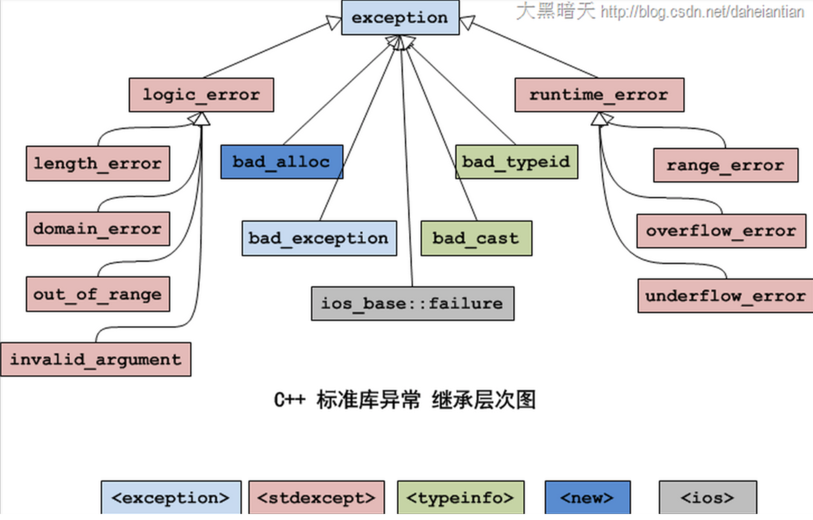

# c++中的异常机制之标准异常



**所有的类都有一个what()方法，返回const char * 类型的字符串，用于描述错误信息**

```
#include <iostream>

using namespace std;

class Teacher {
public:
    Teacher(int age) //构造函数, 通过异常机制 处理错误
    {
        if (age > 100) {
            throw out_of_range("年龄太⼤大");
        }
        this->age = age;
    }
protected:
private:
    int age;
};

int main() {
    try {
        Teacher t1(102);
    }
    catch (out_of_range e) {
        cout << e.what() << endl;
    }
    return 0;
}
```
