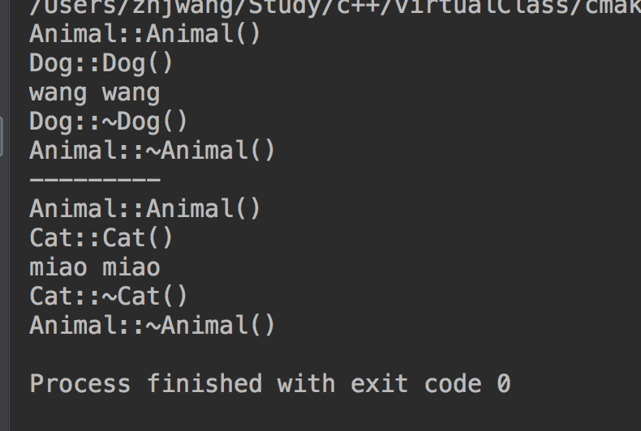

# c++中面向抽象类编程案例
动物园叫声

animal.h
```
//
// Created by Zhangjun Wang  on 2018/6/13.
//

#ifndef VIRTUALCLASS_ANIMAL_H
#define VIRTUALCLASS_ANIMAL_H


class Animal {
public:
    Animal();
    virtual ~Animal();
    virtual void voice() = 0;
};


#endif //VIRTUALCLASS_ANIMAL_H

```

animal.cpp
```
//
// Created by Zhangjun Wang  on 2018/6/13.
//

#include <iostream>
#include "../header/Animal.h"

using namespace std;

Animal::Animal() {
    cout << "Animal::Animal()" << endl;
}

Animal::~Animal() {
    cout << "Animal::~Animal()" << endl;
}
```
dog.h
```
//
// Created by Zhangjun Wang  on 2018/6/13.
//

#ifndef VIRTUALCLASS_DOG_H
#define VIRTUALCLASS_DOG_H


#include "Animal.h"

class Dog : public Animal{
public:
    Dog();
    ~Dog();
    virtual void voice();
};


#endif //VIRTUALCLASS_DOG_H

```
dog.cpp
```
//
// Created by Zhangjun Wang  on 2018/6/13.
//

#include "../header/Dog.h"
#include "iostream"

using namespace std;

Dog::Dog()
{
    cout<<"Dog::Dog()"<<endl;
}
Dog::~Dog()
{
    cout<<"Dog::~Dog()"<<endl;
}
void Dog:: voice()
{
    cout<<"wang wang"<<endl;
}

```
cat.h
```
//
// Created by Zhangjun Wang  on 2018/6/13.
//

#ifndef VIRTUALCLASS_CAT_H
#define VIRTUALCLASS_CAT_H


#include "Animal.h"

class Cat: public Animal {
public:
    Cat();
    ~Cat();
    virtual void voice();
};


#endif //VIRTUALCLASS_CAT_H

```
cat.cpp
```
//
// Created by Zhangjun Wang  on 2018/6/13.
//

#include "../header/Cat.h"
#include "iostream"

using namespace std;
Cat::Cat() {
    cout<<"Cat::Cat()"<<endl;
}
Cat::~Cat()
{
    cout<<"Cat::~Cat()"<<endl;
}
void Cat::voice()
{
    cout<<"miao miao "<<endl;
}

```
main
```
#include "header/Animal.h"
#include "header/Dog.h"
#include "iostream"
#include "header/Cat.h"

using  namespace std;

int main(){
    Animal *pa = new Dog();
    pa->voice();
    delete pa;

    cout << "---------" << endl;
    pa = new Cat();
    pa->voice();
    delete pa;
    return 0;
}
```


