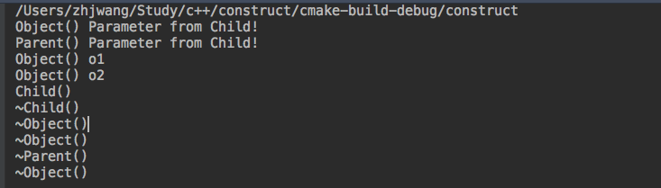

# c++中继承中的构造和析构


* 在子类对象构造时，需要调用父类构造函数对其继承得来的成员进行初始化.

* 在子类对象析构时，需要调用父类析构函数对其继承得来的成员进行清理.

```
#include <iostream>
using namespace std;
class Parent
{
public:
   Parent(const char* s)
   {
       this->s = s;
       cout<<"Parent()"<<" "<<s<<endl;
   }
   ~Parent()
   {
        cout<<"~Parent()"<<endl;
   }
private:
    const char *s;
};
class Child : public Parent
{
public:
    Child(int a) : Parent("Parameter from Child!")
    {
        cout<<"Child()"<<endl;
        this->a = a;
    }
    Child(int a, const char *s) : Parent(s)
    {
        cout<<"Child()"<<endl;
        this->a = a;
    }
    ~Child()
    {
        cout<<"~Child()"<<endl;
    }
private:
    int a;
};

void run()
{
    //Child child(10);
    Child child(10, "Parameter form child...");
}
int main(int argc, char *argv[])
{
  run();
  return 0;
}

```

### 2.继承中构造析构调用原则
1、子类对象在创建时会首先调用父类的构造函数

2、父类构造函数执行结束后，执行子类的构造函数

3、当父类的构造函数有参数时，需要在子类的初始化列表中显示调用

4、析构函数调用的先后顺序与构造函数相反
#### 2.1. 继承和组合并存，构造和析构原则
1. 先构造父类，再构造成员变量、最后构造自己

2. 先析构自己，在析构成员变量、最后析构父类

```
#include <iostream>

using namespace std;

class Object
{
public:
    Object(const char* s)
    {
        cout<<"Object()"<<" "<<s<<endl;
    }
    ~Object() {
        cout<<"~Object()"<<endl;
    }
};
class Parent : public Object
{
public:
    Parent(const char* s) : Object(s)
    {
        cout<<"Parent()"<<" "<<s<<endl;
    }
    ~Parent() {
        cout<<"~Parent()"<<endl;
    }
};

class Child : public Parent
{
public:
    Child() : o2("o2"), o1("o1"), Parent("Parameter from Child!")
    {
        cout<<"Child()"<<endl;
    }
    ~Child() {
        cout<<"~Child()"<<endl;
    }
private:
    Object o1;
    Object o2;
};


void run() {
    Child child;
}
int main(int argc, char *argv[])
{
    run();
    return 0;
}

```

