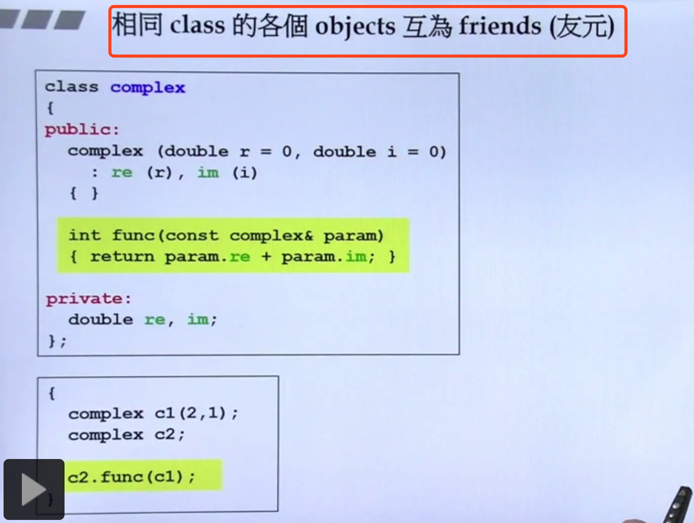

# c++侯捷

### 1.const习惯
如果一个成员函数不能改变数据，就一定加上const,注意大手笔：
```
double image() const {return im;}  //表示的是这个函数不能修改im的值，如果修改了就会报错。
const double image() {return im;} //表示返回值是一个const类型的。
```

### 2.传值还是传引用
最好所有的值都传递引用，不要传递值。这样效率会高。
因为引用其实是一个指针，只有四个字节，如果是值拷贝，这个值如果占用很大的话，那就效率很低，但是有一种情况，比如说我是传递一个字符（只占用一个字节），那么这个时候是传值呢还是传递引用呢？

### 3.友元的新解释
下面这个常见的例子，看起来破坏了封装性，为什么，如下解释。


### 4.一个好的类
* 1.数据都是Private的。
* 2.参数都是引用。（要不要加const，视情况而定）
* 3.返回值尽量也是引用的。
