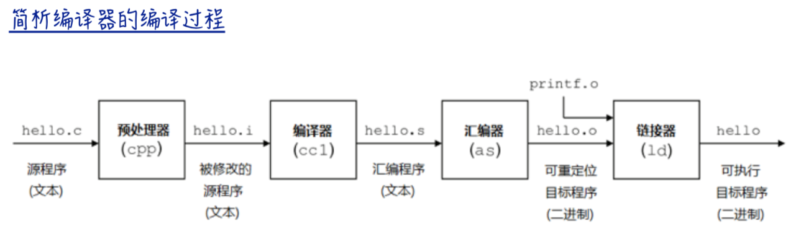

# c++函数模板是如何实现的



```
g++ -E hello.c -o hello.i(预处理)
g++ -S hello.i -o hello.s(编译)
g++ -c hello.s -o hello.o(汇编)
g++ hello.o -o hello(链接)
以上四个步骤，可合成一个步骤
g++ hello.c -o hello(直接编译链接成可执行目标文件)
```

* 1. 编译器并不是把函数模板处理成能够处理任意类的函数
* 2. 编译器从函数模板通过具体类型产生不同的函数
* 3. 编译器会对函数模板进行两次编译,在声明的地方对模板代码本身进行编译; 在调用的地方对参数替换后的代码进行编译。
